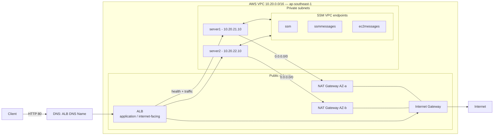
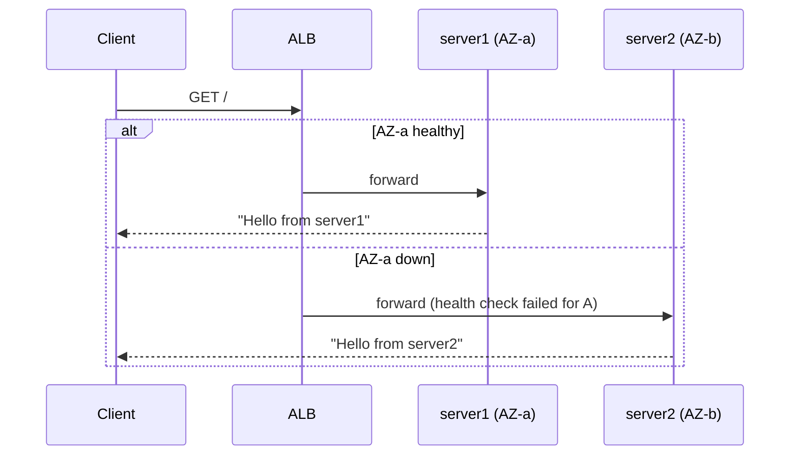

# Architecture — Production-Style AWS Web Infrastructure

This document is the deep-dive architecture reference for the `aws-tfm` production-style web stack deployed with Terraform in `ap-southeast-1` (Singapore).

---

## 1. Overview

A highly available, two-AZ web tier:

- **Ingress:** Internet → internet-facing **ALB** (public subnets, HTTP:80)
- **Compute:** 2× Amazon Linux 2023 EC2 (`server1`, `server2`) in **private subnets** (one per AZ)
- **Egress:** 1× **NAT Gateway per AZ** for outbound internet from private instances
- **Management:** AWS Systems Manager Session Manager via IAM instance profile + VPC endpoints

Traffic never touches EC2 directly from the internet. The only public network entry point is the ALB.

## 2. Mermaid diagrams

### 2.1 End-to-end traffic flow



### 2.2 Resource topology (HCL layers)

```mermaid
graph TD
    V[aws_vpc.main<br/>10.20.0.0/16] --> SUBS1[aws_subnet.public[0]<br/>10.20.1.0/24]
    V --> SUBS2[aws_subnet.public[1]<br/>10.20.2.0/24]
    V --> PRIV1[aws_subnet.private[0]<br/>10.20.21.0/24]
    V --> PRIV2[aws_subnet.private[1]<br/>10.20.22.0/24]
    V --> IGW[aws_internet_gateway.main]

    IGW --> RTpub0[aws_route_table.public[0]]
    IGW --> RTpub1[aws_route_table.public[1]]

    EIP0[aws_eip.nat[0]] --> NGW0[aws_nat_gateway.main[0]]
    EIP1[aws_eip.nat[1]] --> NGW1[aws_nat_gateway.main[1]]

    NGW0 --> RTprv0[aws_route_table.private[0]]
    NGW1 --> RTprv1[aws_route_table.private[1]]
    RTprv0 --> PRIV1
    RTprv1 --> PRIV2

    ALBLB[aws_lb.main] --> TG[aws_lb_target_group.web]
    TG --> LIS[aws_lb_listener.http]
    LIS --> ALBLB
    TG --> ATT0[aws_lb_target_group_attachment[0]]
    TG --> ATT1[aws_lb_target_group_attachment[1]]
    ATT0 --> EC20[aws_instance.web[0] - server1]
    ATT1 --> EC21[aws_instance.web[1] - server2]

    SGA[aws_security_group.alb] --> ALBLB
    SGW[aws_security_group.web] --> EC20
    SGW --> EC21

    IAM[aws_iam_role.web_instance] --> EC20
    IAM --> EC21
    EP[aws_vpc_endpoint.ssm*] --> EC20
    EP --> EC21
```

### 2.3 AZ failure story



## 3. Region / AZ design

- Region `ap-southeast-1`, using `ap-southeast-1a` and `ap-southeast-1b`.
- AZs are read from `data "aws_availability_zones"` at plan time, sliced to `var.az_count`.

## 4. IP design

| Network | CIDR | Subnets |
|---------|------|---------|
| VPC | `10.20.0.0/16` | — |
| Public | `10.20.1.0/24`, `10.20.2.0/24` | ALB nodes + NAT GW |
| Private app | `10.20.21.0/24`, `10.20.22.0/24` | EC2 app servers |

Derivation pattern: `cidrsubnet(var.vpc_cidr, 8, index+...)` keeps subnets reproducible and non-overlapping.

## 5. Resilience / reliability

- Multi-AZ subnets on both tiers.
- **NAT per AZ** → no shared-fate network path for egress.
- ALB health checks + round-robin across 2 targets.
- Encrypted EBS root volumes.
- Deletion protection on the ALB.

## 6. Explicit single points of failure

- Single region (no DR).
- Two fixed-size EC2 instances (no ASG) → no self-healing on instance failure.
- No data layer; stateful workloads need a separate design.