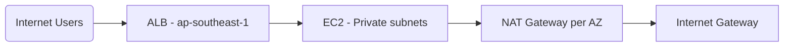
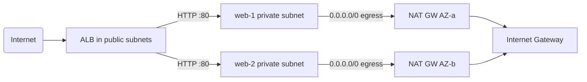

# Architecture — Production-Style AWS Web Infrastructure

This document is the deep-dive architectural reference for the `aws-tfm` stack deployed with Terraform in `ap-southeast-1` (Singapore).

---

## 1. Overview

A highly available, two-AZ web tier:

- Likely the most common pattern:
  - **Ingress:** Internet → internet-facing ALB (public subnets, HTTP:80)
  - **Compute:** 2× Amazon Linux 2023 EC2 (`web-1`, `web-2`) in **private subnets** (one per AZ)
  - **Egress:** NAT Gateway per AZ
- **Management:** AWS Systems Manager Session Manager via IAM instance profile + VPC private endpoints

Traffic never reaches EC2 directly from the internet. The only network entry point is the ALB.

## 2. Traffic topology

The original target diagram is:

The final network flow:

## 3. Subnets (VPC = `10.20.0.0/16`)

| Tier | Subnets | AZ | CIDR |
| --- | --- | --- | --- |
| Public | public-1 | A | 10.20.1.0/24 |
| Public | public-2 | B | 10.20.2.0/24 |
| Private | private-1 | A | 10.20.21.0/24 |
| Private | private-2 | B | 10.20.22.0/24 |

Both public/private are spread across both AZs so we never place the entire web tier in one AZ.

## 4. Load balancer

- Resource `aws_lb` (ALB), internet-facing (`internal = false`), dual subnets.
- Listener on port 80 with upstream instance target group.
- Health check on `/health.html` on both targets, matcher 200, 30s timeout default.

## 5. Compute

- Two instances (`t3.micro`) to reduce cost, one per AZ.
- Amazon Linux 3 AMI; root EBS encrypted (`gp3`).
- IMDSv2-only (`http_tokens = required`) to mitigate SSRF/OPS-2021-использование misconfiguration.

## 6. Data plane reliability

- No ASG — no auto-healing.
- ALB monitors health (HTTP 200) and removes unhealthy targets.
- NAT per AZ; a single NAT crash only affects its own AZ.

## 7. Control plane / management

- IAM instance profile with `AmazonSSMManagedInstanceCore`.
- SSM/VPC interfaces: `ssm`, `ssmmessages`, `ec2messages`.
- For Linux nodes, connect via `aws ssm start-session`.

## 8. Notes

- Region-level failure is not covered.
- This is a demo config — validation & plan only.

_Generated by the same team that authored the plan, from the actual plan files._
