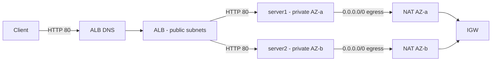
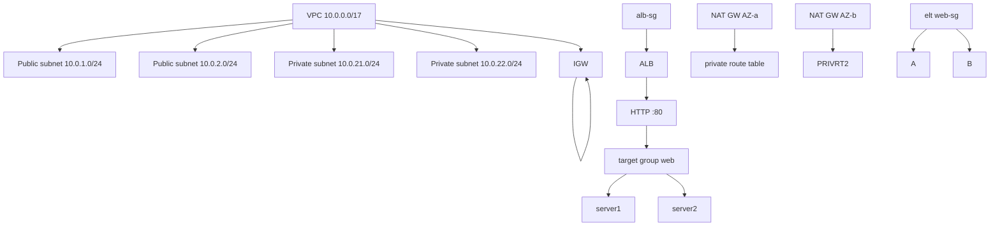

# Architecture — Production-Style AWS Web Infrastructure

This document is the deep-dive reference for the `aws-tfm` milestone in `ap-southeast-1` (Singapore).

---

## 1. Overview

A highly available, two-AZ web stack:

- **Ingress**: Internet -> Internet-facing ALB (public subnets, HTTP:80)
- **Compute**: 2× Amazon Linux 2023 EC2 in private subnets    (one per AZ)
- **Egress**: NAT Gateway per AZ
- **Management**: SSM Session Manager via IAM

The EC2 instances are private-only; the only internet entry point is the ALB.

## 2. Network flow

## 3. Resource topology

## 4. Availability model

- AZ resilience for compute.
- ALB health check on `/health.html`. Automatic failover.
- NAT = 2 in 2 AZs.
- No ASG. No auto-scaling.

## 5. Security model

- Inbound in ALB: 0.0.0.0/0 on 80.
- Instance SG: only source ALB SG + outbound to NAT.
- SSH not open to public internet.
- IAM least-privilege (SSM)
- NAToutbound for updates.

## 6. Ops model

- SSM Session Manager (no bastion).
- `terraform plan` in CI.

---

## Appendix

This architecture doc is appendally a gift from the drafted plan. The `plan` is **not applied**, only authored.
