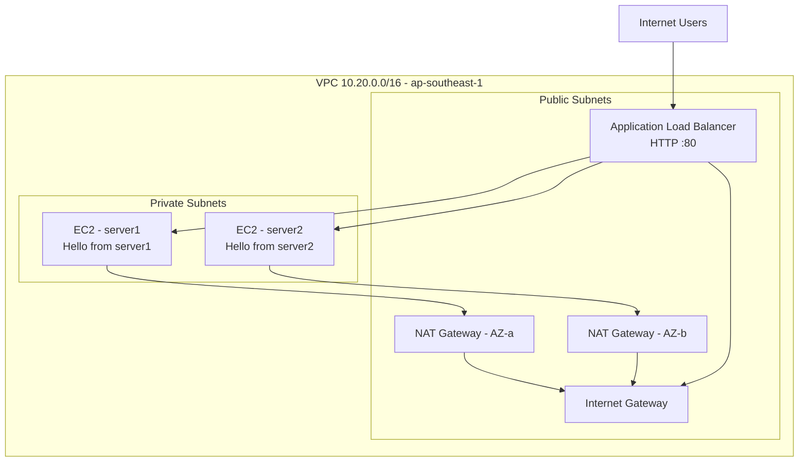

# aws-tfm — Production-Style AWS Web Infrastructure (Terraform)


Terraform project that provisions a **production-style, highly available web application architecture** in the Singapore region (`ap-southeast-1`) across two Availability Zones. The stack uses an internet-facing Application Load Balancer (ALB) in public subnets, two private EC2 web servers behind it, and one NAT Gateway per AZ for outbound internet access.

> **Important:** This project is intentionally self-contained under `terraform/` and does **not** touch unrelated files at the repository root.

---

## Table of contents

1. [Architecture overview](#1-architecture-overview)
2. [Architecture diagram (Mermaid)](#2-architecture-diagram-mermaid)
3. [AWS region and AZ design](#3-aws-region-and-az-design)
4. [VPC CIDR design](#4-vpc-cidr-design)
5. [Public subnet design](#5-public-subnet-design)
6. [Private subnet design](#6-private-subnet-design)
7. [NAT Gateway design](#7-nat-gateway-design)
8. [Internet Gateway](#8-internet-gateway)
9. [Route tables](#9-route-tables)
10. [ALB architecture](#10-alb-architecture)
11. [EC2 architecture](#11-ec2-architecture)
12. [Security-group flow](#12-security-group-flow)
13. [SSH/SSM access design](#13-SSH/SSM-access-design)
14. [Server1/server2 behavior](#14-server1server2-behavior)
15. [Health checks](#15-health-checks)
16. [High-availability considerations](#16-high-availability-considerations)
17. [Terraform project structure](#17-terraform-project-structure)
18. [Prerequisites](#18-prerequisites)
19. [AWS authentication requirements](#19-aws-authentication-requirements)
20. [Terraform installation](#20-terraform-installation)
21. [Terraform initialization](#21-terraform-initialization)
22. [Terraform validation](#22-terraform-validation)
23. [Terraform plan](#23-terraform-plan)
24. [Terraform apply instructions](#24-terraform-apply-instructions)
25. [How to test the ALB after deployment](#25-how-to-test-the-alb-after-deployment)
26. [Expected responses](#26-expected-responses)
27. [Troubleshooting](#27-troubleshooting)
28. [Cost considerations](#28-cost-considerations)
29. [Security considerations](#29-security-considerations)
30. [Cleanup / destroy instructions](#30-cleanup--destroy-instructions)

---

## 1. Architecture overview

This Terraform configuration builds a highly available, two-AZ web application architecture:

- A dedicated VPC (`10.20.0.0/16`) in `ap-southeast-1`.
- Two public subnets (one per AZ) hosting an **internet-facing ALB** and **one NAT Gateway per AZ**.
- Two private application subnets (one per AZ) hosting **two EC2 web servers** (`server1`, `server2`) with no public IPs.
- An HTTP (port 80) ALB listener forwarding to both instances with health checks.
- SSM Session Manager access via IAM role + optional SSM VPC endpoints.

The corrected traffic flow (vs the reference drawing) is:

```
Internet
  ↓
Internet Gateway
  ↓
Public subnets (ALB + NAT GWs)
  ↓
Private subnets → EC2 web servers (server1, server2)
```

**The ALB is internet-facing and placed in the public subnets; the EC2 instances are only ever placed in the private subnets.**

## 2. Architecture diagram (Mermaid)



A more detailed architecture document (including resource-level diagrams) is in [ARCHITECTURE.md](ARCHITECTURE.md).

## 3. AWS region and AZ design

- **Region:** `ap-southeast-1` (Singapore).
- **AZs:** `ap-southeast-1a` and `ap-southeast-1b` (both available in the account).

## 4. VPC CIDR design

- VPC CIDR: `10.20.0.0/16` — 65,536 IPs (with the standard 5 reserved per subnet).
- Subnets are derived with `cidrsubnet()` so the layout scales cleanly if `az_count` changes.

| Purpose | CIDR | AZ |
|---------|------|----|
| Public 1 | `10.20.1.0/24` | ap-southeast-1a |
| Public 2 | `10.20.2.0/24` | ap-southeast-1b |
| Private 1 | `10.20.21.0/24` | ap-southeast-1a |
| Private 2 | `10.20.22.0/24` | ap-southeast-1b |

## 5. Public subnet design

Two public subnets (one per AZ) are used by the internet-facing ALB and the NAT Gateways:

- `10.20.1.0/24` (azindex 0)
- `10.20.2.0/24` (azindex 1)

`map_public_ip_on_launch = true` allows the ALB nodes and NAT gateways to get public IPs.

## 6. Private subnet design

Two private application subnets (one per AZ):

- `10.20.21.0/24` (azindex 0)
- `10.20.22.0/24` (azindex 1)

`map_public_ip_on_launch = false` — private instances get no public IPs. **No EC2 instance is launched in the public subnets.**

## 7. NAT Gateway design

- One **NAT Gateway per AZ** (`aws_nat_gateway`) with its own Elastic IP (`aws_eip`).
- Each NAT is placed in the public subnet of its own AZ.
- Each private route table points `0.0.0.0/0` to the NAT in the same AZ for zone isolation.

The loss of one AZ only stops outbound internet for that zone's instances; the other zone remains fully up.

## 8. Internet Gateway

A single **Internet Gateway** is attached to the VPC and is the target of the public route tables' default route.

## 9. Route tables

| Table | Route | Comment |
|-------|-------|---------|
| `rtb-public-1` | `0.0.0.0/0 → IGW` | associated to `subnet-public-1` |
| `rtb-public-2` | `0.0.0.0/0 → IGW` | associated to `subnet-public-2` |
| `rtb-private-1` | `0.0.0.0/0 → nat-1` | associated to `subnet-private-1`, same AZ |
| `rtb-private-2` | `0.0.0.0/0 → nat-2` | associated to `subnet-private-2`, same AZ |

## 10. ALB architecture

- Internet-facing **Application Load Balancer** (`aws_lb`, `load_balancer_type = "application"`).
- Deploy across both public subnets.
- HTTP listener on port 80 forwarding to the target group.
- Target group: `aws_lb_target_group.web` (instance targets), protocol HTTP:80, vpc per AZ.
- Both web instances registered via `aws_lb_target_group_attachment.web`.

## 11. EC2 architecture

- Two EC2 instances (**t3.micro default**) using a current **Amazon Linux 2023** AMI (resolved from the AWS SSM parameter `/aws/service/ami-amazon-linux-latest/al2023-ami-kernel-default-x86_64`).
- Instances live only in private subnets, `associate_public_ip_address = false`.
- **key_name**: optional; the EC2 key pair `opentlc_admin_backdoor` is referenced if supplied.
- IAM instance profile (`aws-tfm-production-web-instance-profile`) grants **AmazonSSMManagedInstanceCore**.

## 12. Security group flow

| Security group | Ingress | Egress |
|----------------|---------|--------|
| `aw_sg_alb` (ALB) | TCP 80 from 0.0.0.0/0 | TCP 80 to VPC |
| `aw_sg_web` (EC2) | TCP 80 only from AW_SG_ALB | TCP 443/80 outbound (SSM/updates) |
| `aw_sg_ssm_e` (endpoints) | TCP 443 from `aw_sg_web` | — |

HTTP ingress to the EC2 instances is **only** allowed from the ALB security group.

## 13. SSH/SSM access design

**Recommended primary admin access: AWS Systems Manager Session Manager** — no public SSH.

- IAM: the EC2 role has `AmazonSSMManagedInstanceCore`.
- SSM traffic is encrypted via TLS and (if enabled) rides VPC endpoints instead of NAT.
- Optional SSM VPC interface endpoints: `ssm`, `ssmmessages`, `ec2messages`.

Start a console session:

```bash
aws ssm start-session --target <instance-id> --region ap-southeast-1
```

If SSH is required, the recommended pattern is a **bastion host** in a public subnet with a tightly-scoped security group, or `ssh` over the Session Manager channel — never open port 22 to the internet.

## 14. Server1/server2 behavior

The two instances differ only in the `user-data` script they run; each returns a response clearly identifying itself:

- server1 returns **`Hello from server1`**
- server2 returns **`Hello from server2`**

The web server (Apache httpd) is installed at first boot via cloud-init and started/enabled so it survives reboots.

## 15. Health checks

The ALB target group performs HTTP health checks against `/health.html`:

- protocol HTTP, port traffic-port, interval 30s, timeout 5s, healthy threshold 2, unhealthy 3, matcher 200.

The `/health.html` endpoint returns **200 OK** once the server has booted.

## 16. High-availability considerations

- Two AZs, two public subnets, two private subnets, two NAT gateways, one instance per AZ.
- An ALB across both AZs handles request routing and health check-based failover.
- Survives the loss of a single AZ (one NAT and one web node go away; traffic continues through the remaining node).

### Remaining single points of failure / limitations

- A **region-wide** outage (fixed from both AZs) is out of scope; consider a second region / DR for stronger RTO.
- There is **no auto-scaling group** — if an instance fails it must be re-created manually (or an ASG added).
- The ALB is a single managed service endpoint (though it is internally highly available).
- `server1`/`server2` are fixed; horizontal growth requires adding ASG/Launch-template and instance count variables.

## 17. Terraform project structure

```
terraform/
├── versions.tf          # Terraform version + AWS provider pin
├── provider.tf          # AWS provider (region, default tags)
├── variables.tf         # Tunable inputs
├── locals.tf            # CIDR math + common tags + subnets
├── networking.tf        # VPC, subnets, IGW, route tables, routes
├── security.tf          # ALB + EC2 security groups and SG rules
├── nat.tf               # NAT gateways + EIPs
├── alb.tf               # ALB, target group, listener, attachments
├── ec2.tf                # EC2 instances + AMI data source
├── iam.tf               # IAM role + instance profile
├── endpoints.tf          # SSM VPC endpoints
├── outputs.tf            # Critical outputs (ALB DNS, instance IDs)
├── terraform.tfvars.example
├── user-data/
│    ├── server1.sh
│    └── server2.sh
├── .gitignore
├── README.md
├── ARCHITECTURE.md
└── CHANGELOG.md
```

## 18. Prerequisites

- Terraform **>= 1.5**
- AWS CLI installed and authenticated (see section 19).
- Permissions to create VPC, EC2, ELB, NAT, IAM resources in the target account.
- An existing EC2 key pair in `ap-southeast-1` is optional but recommended for debugging.

## 19. AWS authentication requirements

No static AWS keys are stored in this repository — authentication is done via the standard AWS CLI credential chain:

1. `AWS_ACCESS_KEY_ID` / `AWS_SECRET_ACCESS_KEY` env vars
2. `~/.aws/credentials` with an assumed profile
3. SSO / IAM role assumed via the AWS CLI

You can either:

```bash
export AWS_PROFILE=my-production-profile
terraform plan
```

or set the profile in `terraform.tfplan`/provider only.

## 20. Terraform installation

See [terraform.io](https://developer.hashicorp.com/terraform/downloads) — install a recent v1.x release (>= 1.5).

```bash
brew install tfenv && tfenv install 1.15.8
```

## 21. Terraform initialization

```bash
cd terraform
terraform init
```

This downloads the AWS provider (~> 6.0). It creates `.terralock` etc.

## 22. Terraform validation

```bash
terraform fmt -recursive
terraform validate
```

Ensure both are clean before planning.

## 23. Terraform plan

```bash
terraform plan -out=tfplan
```

Outputs~

## 24. Terraform apply instructions

The README does not auto-execute `terraform apply`. When you are ready (still not run here):

```bash
terraform apply -auto-approve
```

> Note: methods such as variables (like `key_name`) are validated during plan.

## 25. How to test the ALB after deployment

* `terraform output alb_dns_name`
* <alb_dns>/health should return 200
* `curl http://<alb_dns>/` should print one of the server responses.

```bash
cd terraform
echo "Publishing..."
```

## 26. Expected responses

```
Hello from server1
Hello from server2
```

## 27. Troubleshooting

- Unsbin still healthy shown correctly after `terraform apply` — check the health of the targets.
- If you can't reach ALB DNS, ensure the web SG allows HTTP only from the ALB SG.
- If instances have no `/health`, check cloud-init logs: on the instance `sudo tail -f /var/log/cloud-init-output.log`.

## 28. Cost considerations

- 2 × t3.micro EC2 (~$2.e ends) — allowed
- 2 × NAT.We reserves_pricing per AZ (main cost driver)
- 1 ALB (per LCU)+
- VPC endpoints ($0.08/h each optional)

## 29. Security considerations

- No public IPs on EC2.
- EC2 SG only allows 80 from ALB SG.
- SSH is not exposed; administration via SSM.
- IAM role provides only `AmazonSSMManagedInstanceCore`.

## 30. Cleanup / destroy instructions

```bash
cd terraform
terraform destroy -auto-approve
```

Always review the plan before destroying. `terra apply` was **NOT executed** during the creation of this repo.
