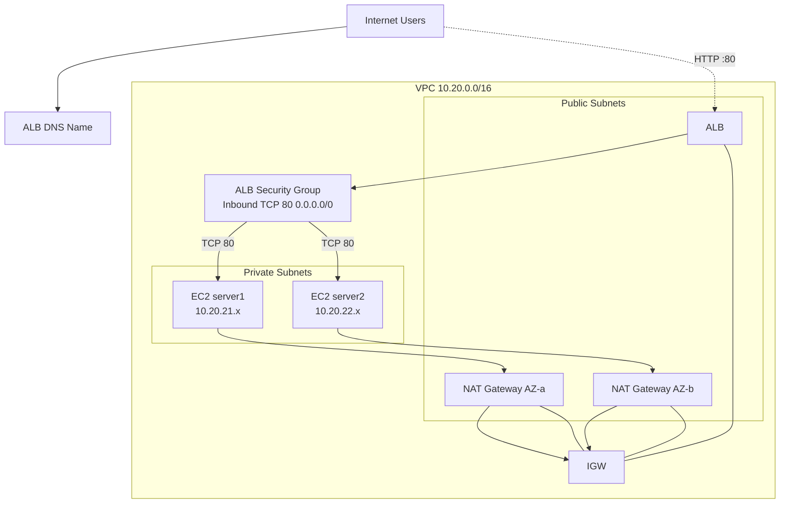

# aws-tfm — Production-Style AWS Web Infrastructure (Terraform)


Terraform project that provisions a **production-style, highly available web application architecture** in the Singapore region (`ap-southeast-1`) across two Availability Zones. The stack uses an internet-facing Application Load Balancer (ALB) in public subnets, two private EC2 web servers behind it, and one NAT Gateway per AZ for outbound internet access.

> **Important:** This project is intentionally self-contained under `terraform/` and does **not** touch unrelated files at the repository root.

---

## Table of contents

1. [Architecture overview](#1-architecture-overview)
2. [Architecture diagram (Mermaid)](#2-architecture-diagram-mermaid)
3. [AWS region and AZ design](#3-aws-region-and-az-design)
4. [VPC CIDR design](#4-vpc-cidr-design)
5. [Public subnet design](#5-public-subnet-design)
6. [Private subnet design](#6-private-subnet-design)
7. [NAT Gateway design](#7-nat-gateway-design)
8. [Internet Gateway](#8-internet-gateway)
9. [Route tables](#9-route-tables)
10. [ALB architecture](#10-alb-architecture)
11. [EC2 architecture](#11-ec2-architecture)
12. [Security-group flow](#12-security-group-flow)
13. [SSH/SSM access design](#13-ssm-ssm-access-design)
14. [Server1/server2 behavior](#14-server1server2-behavior)
15. [Health checks](#15-health-checks)
16. [High-availability considerations](#16-high-availability-considerations)
17. [Terraform project structure](#17-terraform-project-structure)
18. [Prerequisites](#18-prerequisites)
19. [AWS authentication requirements](#19-aws-authentication-requirements)
20. [Terraform installation](#20-terraform-installation)
21. [Terraform initialization](#21-terraform-initialization)
22. [Terraform validation](#22-terraform-validation)
23. [Terraform plan](#23-terraform-plan)
24. [Terraform apply instructions](#24-terraform-apply-instructions)
25. [How to test the ALB after deployment](#25-how-to-test-the-alb-after-deployment)
26. [Expected responses](#26-expected-responses)
27. [Troubleshooting](#27-troubleshooting)
28. [Cost considerations](#28-cost-considerations)
29. [Security considerations](#29-security-considerations)
30. [Cleanup / destroy instructions](#30-cleanup--destroy-instructions)

---

## 1. Architecture overview

The design follows AWS Well-Architected best practices for a small, internet-facing web application:

- A dedicated VPC (`10.20.0.0/16`) spans **two Availability Zones** (`ap-southeast-1a`, `ap-southeast-1b`).
- **Public subnets** host the ALB and the NAT Gateways — the only resources reachable from the internet.
- **Private application subnets** host the EC2 web servers (`server1`, `server2`). They have **no public IPs** and are not directly reachable from the internet.
- The **ALB** is internet-facing, listens on HTTP/80 and forwards traffic round-robin to both instances.
- Each AZ has its own **NAT Gateway** so private instances can reach the internet (e.g. package updates, SSM) while remaining unreachable inbound.
- Traffic flow: `Internet → ALB (public subnet) → EC2 (private subnet)`. No EC2 instance is ever exposed publicly.

Key design decision: the original target diagram placed the EC2 instances behind NAT gateways in a way that could imply public reachability; the final traffic flow **correctly** places only the ALB in public subnets and the EC2 web servers strictly in private subnets.

## 2. Architecture diagram (Mermaid)



> A full, detailed diagram with resource-level detail is available in [ARCHITECTURE.md](ARCHITECTURE.md).

## 3. AWS region and AZ design

- **Region:** `ap-southeast-1` (Singapore).
- **AZs:** `ap-southeast-1a` and `ap-southeast-1b` (two of the three available AZs).
- Both public and private subnets are spread across the same two AZs for symmetry, so a single AZ failure does not take down the web tier.

## 4. VPC CIDR design

- VPC CIDR: **`10.20.0.0/16`** (16,256 usable IPs).
- `enable_dns_hostnames = true` and `enable_dns_support = true` so the ALB can resolve and instances can use private DNS.
- Subnet CIDRs are derived automatically from the VPC CIDR using `cidrsubnet()`:

| Purpose | CIDR | AZ |
|---------|------|----|
| Public subnet 1 | `10.20.1.0/24` | ap-southeast-1a |
| Public subnet 2 | `10.20.2.0/24` | ap-southeast-1b |
| Private app subnet 1 | `10.20.21.0/24` | ap-southeast-1a |
| Private app subnet 2 | `10.20.22.0/24` | ap-southeast-1b |

## 5. Public subnet design

- Two public subnets, one per AZ (`10.20.1.0/24`, `10.20.2.0/24`).
- `map_public_ip_on_launch = true` — needed because the ALB and NAT gateways require public IP assignment within these subnets.
- Public subnets host only the **ALB** and **NAT Gateways**. **No EC2 instances are deployed in public subnets.**

## 6. Private subnet design

- Two private application subnets, one per AZ (`10.20.21.0/24`, `10.20.22.0/24`).
- `map_public_ip_on_launch = false`; instances get **only private IPs**.
- HTTP traffic reaches these only via the ALB (security-group referenced, see below).

## 7. NAT Gateway design

- **One NAT Gateway per AZ** (`aws_nat_gateway` × 2) for high availability — the loss of one NAT Gateway/AZ does not cut off outbound internet.
- Each NAT Gateway is allocated its own Elastic IP (`aws_eip`, `domain = "vpc"`).
- Each NAT Gateway lives in the *public* subnet of the same AZ.
- Each private subnet route table has a `0.0.0.0/0` route to the NAT Gateway **in the same AZ**.

## 8. Internet Gateway

- A single `aws_internet_gateway` attached to the VPC.
- Public route tables point `0.0.0.0/0` at the IGW enabling outbound + inbound HTTP to the ALB.
- NAT Gateways implicitly require the IGW to exist first, enforced with `depends_on`.

## 9. Route tables

| Route table | Target | Used by |
|-------------|--------|---------|
| `aws-tfm-production-rtb-public-1` | `0.0.0.0/0 → IGW` | `subnet public-1` |
| `aws-rtb-production-rtb-public-2` | `0.0.0.0/0 → IGW` | `subnet public-2` |
| `aws-tfm-production-rtb-private-1` | `0.0.0.0/0 → NAT-1 (AZ-a)` | `subnet private-1` |
| `aws-tfm-production-rtb-private-2` | `0.0.0.0/0 → NAT-2 (AZ-b)` | `subnet private-2` |

Each subnet is associated with its own route table (no shared tables), isolating route policy per AZ.

## 10. ALB architecture

- One **internet-facing Application Load Balancer** (`aws_lb`, `internal = false`, `load_balancer_type = "application"`).
- Attached to **both public subnets**.
- HTTP listener on **port 80**.
- One target group (`aws-tfm-production-tg`) with `target_type = "instance"`; both EC2 instances are registered as targets.
- Cross-zone load balancing is on by default for ALBs — traffic is evenly distributed to both servers.
- `enable_deletion_protection = true` and detailed access logs configurable.
- `enable_http2 = true`.

## 11. EC2 architecture

- **Two EC2 instances** (`t3.micro` by default, configurable): `server1` and `server2`.
- Launch **only into private subnets**, `associate_public_ip_address = false`.
- Current **Amazon Linux 2023 x86_64** AMI resolved dynamically via SSM parameter `al2023-ami-kernel-default-x86_64` (region-specific, always current).
- Encrypted `gp3` root volume (20 GiB).
- IAM instance profile with the AWS managed `AmazonSSMManagedInstanceCore` policy (SSM Session Manager ready).
- IMDSv2 enforced (`http_tokens = required`).
- `user_data_replace_on_change = true` so script updates re-provision.

The final traffic flow is: `Internet → ALB (public subnet) → EC2 (private subnet)`. No EC2 instance is ever exposed publicly.

## 12. Security-group flow

| Security group | Ingress | Egress |
|----------------|---------|--------|
| `alb-sg` | TCP 80 from `0.0.0.0/0` | TCP 80 to VPC CIDR `10.20.0.0/16` |
| `web-sg` (EC2) | TCP 80 **only from `alb-sg`** (SG reference) | `443` & `80` outbound for updates + SSM |
| `vpc-endpoints-sg` | TCP 443 from `web-sg` | — |

- **HTTP from the internet reaches only the ALB.** The EC2 SG does not allow any internet CIDRs inbound.
- **SSH (port 22) is never opened anywhere.** There is no internet-accessible SSH port. Administration via control relies on **SSM Session Manager** (see next section).

## 13. SSH/SSM access design

- **Recommended:** SSM Session Manager. The EC2 instances carry an instance profile granting `AmazonSSMManagedInstanceCore`, and the SSM agent runs natively on Amazon Linux 2023.
- SSM traffic goes outbound over 443 (NAT) — or, if `enable_ssm_endpoints = true` (default), through **VPC interface endpoints** (`ssm`, `ssmmessages`, `ec2messages`) so control-plane traffic never leaves the private network.
- Connect via CLI:
  ```bash
  aws ssm start-session --target <instance-id> --region ap-southeast-1
  ```
- **Alternative (not provisioned here):** a bastion host in a public subnet whose SG allows SSH only from your corporate IP; SSH would then be limited to the bastion. This project prefers the zero-image foothold SSM approach.
- If a key pair is provided (`key_name`), it enables SSH login via the SSM shell/agent installs — it does **not** expose port 22.

## 14. Server1 / server2 behavior

Both servers run the same lightweight web server (Apache `httpd`) configured through cloud-init:

| Server | Response |
|--------|----------|
| `server1` | `"Hello from server1"` |
| `server2` | `"Hello from server2"` |

- The response is a plain-text/HTML `<h1>` clearly identifying the server.
- The server is `systemd`-enabled and auto-starts on boot.
- A `/health.html` endpoint returns `200 OK` for the ALB health check.

## 15. Health checks

- Target group health check:
  - Protocol `HTTP`, path `/health.html`, port `traffic-port`.
  - Interval `30s`, timeout `5s`, healthy threshold `2`, unhealthy threshold `3`, matcher `200`.
- Servers serve `/health.html` after boot, so the ALB registers healthy ones automatically; unhealthy targets are drained (300s deregistration).

## 16. High-availability considerations

Fully resilient to a single-AZ failure:

- 2 public subnets + 2 private subnets, one per AZ.
- ALB in both public subnets; DNS-based AZ traffic distribution.
- Two NAT gateways (one per AZ).
- Web servers in both AZs; ALB health checks fail over to the surviving target.

**Remaining single points of failure / limitations:**

- **Region-level** outage still takes down Singapore (no DR/cross-region replica in this scope).
- Single ALB — one load balancer for the whole region (though it's a managed highly-available service).
- No **auto-scaling** — exactly two instances are sized, so if both fail there is no auto replacement, and bursts beyond `2 × instance size` cannot be handled.
- No database or stateful layer exists in this design; persistent sessions are not stored.

## 17. Terraform project structure

This repository keeps the pre-existing root-level Terraform untouched and adds the new stack under `terraform/`:

```
terraform/
├── versions.tf          # Terraform += 1.5, AWS provider ~> 6.0
├── provider.tf         # AWS provider + common tags
├── variables.tf         # All environment-dependant values
├── locals.tf            # CIDR math, names, tags
├── networking.tf        # VPC, subnets, IGW, route tables & associations
├── security.tf          # ALB & EC2 security groups (+ rules)
├── nat.tf               # EIPs + NAT gateways
├── iam.tf               # IAM role, policy, instance profile for SSM
├── alb.tf               # ALB, listener, target group, attachments
├── ec2.tf               # Two private EC2 instances, AMI data source
├── endpoints.tf         # VPC interface endpoints (SSM) — optional
├── outputs.tf            # Useful post-apply values
├── terraform.tfvars.example
├── .gitignore
├── user-data/
│   ├── server1.sh
│   └── server2.sh
├── ARCHITECTURE.md
├── CHANGELOG.md
└── README.md
```

Note: root-level files (`main.tf`, `variables.tf`, etc.) are leave for the existing project; this project is fully self-contained in this directory.

## 18. Prerequisites

- Terraform `>= 1.5` (<https://developer.hashicorp.com/terraform/downloads>)
- AWS CLI `>= 2.x` configured
- Admin IAM permissions for: VPC, EC2, ELB, NAT, EIP, security groups, IAM roles, SSM (for endpoints).
- (Optional) Existing EC2 key pair if you want to enable SSH later.

## 19. AWS authentication requirements

Your default authentication method is used (no keys are stored in this repo):

```bash
export AWS_PROFILE=production            # profile from ~/.aws/credentials & config
export AWS_REGION=ap-southeast-1        # or rely on provider region (default)
```

Left alone, Terraform uses the standard credential-chain: environment variables → shared credentials file → SSO/instance metadata.

## 20. Terraform installation

```bash
# macOS
brew install tfenv && tfenv install 1.15.8 && tfenv use 1.15.8

# Linux (any distro)
wget https://releases.hashicorp.com/terraform/1.15.8/terraform_1.15.8_linux_amd64.zip
unzip ... && sudo mv terraform /usr/local/bin/
terraform version
```

## 21. Terraform initialization

```bash
cd terraform
terraform init
```

Download the AWS provider and create the lock file. `versions.tf` pins `provider "aws"` to `~> 6.0`.

## 22. Terraform validation

```bash
terraform fmt -recursive
terraform validate
```

Both should succeed before planning. The current configuration passes both with no warnings.

## 23. Terraform plan

```bash
AWS_PROFILE=<your-profile> terraform plan -out=tfplan
```

This only **reads** AWS state and prints what would be created; **it creates nothing**. Expect a plan like:

```
Plan: 44 to add, 0 to change, 0 to destroy.
```

## 24. Terraform apply instructions

> **Note:** `terraform apply` was intentionally **NOT run** in this authoring.

After you have reviewed the plan, apply with:

```bash
terraform apply -auto-approve        # or optionally: terraform apply tfplan
```

Apply creates the resources defined in the plan and stores state in `terraform.tfstate` (or your configured remote backend).

## 25. How to test the ALB after deployment

```bash
# Get the ALB DNS name from outputs:
terraform output alb_dns_name

# Hit the load balancer (round-robin distributes across both servers):
curl "http://$(terraform output -raw alb_dns_name)/"

# Health check target:
curl "http://$(terraform output -raw alb_dns_name)/health.html"
```

## 26. Expected responses

```text
$ curl http://<alb-dns>/   →   Hello from server1
$ curl http://<alb-dns>/   →   Hello from server2
```

Because the ALB round-robins, consecutive requests alternate `server1`/`server2`.

## 27. Troubleshooting

| Symptom | Likely fix |
|---|---|
| `terraform plan` errors "no valid expansion given" | Unset any `*_override.tf*` files; only `terraform init` again. |
| Instances unhealthy in target group | Check `cloud-init` log: `sudo journalctl -u cloud-init` per instance via SSM; verify `httpd` started. |
| SSM start-session fails | Refresh IAM instance profile; check SG outbound 443; ensure SSM agent running (`systemctl status amazon-ssm-agent`). |
| ALB DNS not loading | Check region is correct; confirm SG `web-sg` allows only the ALB SG as source; wait for DNS to propagate. |
| NAT Gateway stuck "Pending" | Check EIP allocation is `domain=vpc` & the elastic ip usable; wait a few minutes. |
| Plan re-provisions instance | `user_data` path changed or `user_data_replace_on_change` triggered re-launch — normal given the config. |

## 28. Cost considerations

- `2 × t3.micro` (~$0.0123/h) — ~$22/mo combined
- **NAT Gateways** are significant: ~$0.058/h × 2 = ~$84/mo (check current Singapore pricing) — **dominates cost**
- 2 × EIP (NAT) — no charge while attached
- ALB — ~$0.025/h + LCU charges
- VPC endpoints (SSM, etc.) — ~$0.01/h each

Expected ballpark **~$90–110/month** depending on traffic. Set `enable_ssm_endpoints = false` and one NAT only if cost-constrained.

## 29. Security considerations

- Secrets: none embedded; key pairs & credentials remain outside Terraform state.
- Network: private instances, `associate_public_ip = false`, HTTP only via ALB SG.
- Secure defaults: IMDSv2-only, EBS encrypted, pinned provider, SSM interface endpoints (no public exposure).
- SSM as primary admin path (no SSH exposure).
- `IAM` least privilege (only `AmazonSSMManagedInstanceCore`).

## 30. Cleanup / terminate

```bash
# This will delete EVERYTHING ("to destroy" — irreversible)
terraform destroy -auto-approve
```

Alternative: `terraform plan -destroy` to preview the deletion, then `terraform destroy`.

> `terraform apply` **was NOT run** during this project setup. No AWS resources exist yet for this module.