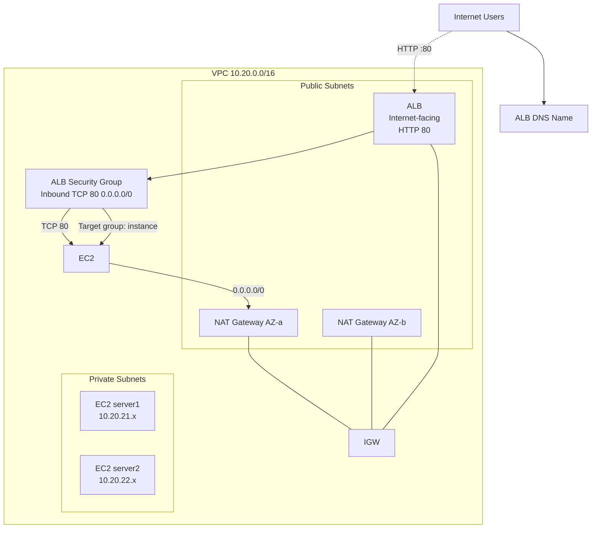

# aws-tfm — Production-Style AWS Web Infrastructure (Terraform)


Terraform project that provisions a **production-style, highly available web application architecture** in the Singapore region (`ap-southeast-1`) across two Availability Zones. The stack uses an internet-facing Application Load Balancer (ALB) in public subnets, two private EC2 web servers behind it, and one NAT Gateway per AZ for outbound internet access.

> **Important:** This project is intentionally self-contained under `terraform/` and does **not** touch unrelated files at the repository root.

---

## Table of contents

1. [Architecture overview](#1-architecture-overview)
2. [Architecture diagram (Mermaid)](#2-architecture-diagram-mermaid)
3. [AWS region and AZ design](#3-aws-region-and-az-design)
4. [VPC CIDR design](#4-vpc-cidr-design)
5. [Public subnet design](#5-public-subnet-design)
6. [Private subnet design](#6-private-subnet-design)
7. [NAT Gateway design](#7-nat-gateway-design)
8. [Internet Gateway](#8-internet-gateway)
9. [Route tables](#9-route-tables)
10. [ALB architecture](#10-alb-architecture)
11. [EC2 architecture](#11-ec2-architecture)
12. [Security-group flow](#12-security-group-flow)
13. [SSH/SSM access design](#13-ssm-ssm-access-design)
14. [Server1/server2 behavior](#14-server1server2-behavior)
15. [Health checks](#15-health-checks)
16. [High-availability considerations](#16-high-availability-considerations)
17. [Terraform project structure](#17-terraform-project-structure)
18. [Prerequisites](#18-prerequisites)
19. [AWS authentication requirements](#19-aws-authentication-requirements)
20. [Terraform installation](#20-terraform-installation)
21. [Terraform initialization](#21-terraform-initialization)
22. [Terraform validation](#22-terraform-validation)
23. [Terraform plan](#23-terraform-plan)
24. [Terraform apply instructions](#24-terraform-apply-instructions)
25. [How to test the ALB after deployment](#25-how-to-test-the-alb-after-deployment)
26. [Expected responses](#26-expected-responses)
27. [Troubleshooting](#27-troubleshooting)
28. [Cost considerations](#28-cost-considerations)
29. [Security considerations](#29-security-considerations)
30. [Cleanup / destroy instructions](#30-cleanup--destroy-instructions)

---

## 1. Architecture overview

The design follows AWS Well-Architected best practices for a small, internet-facing web application:

- A dedicated VPC (`10.20.0.0/17`) spans **two Availability Zones** (`ap-southeast-1a`, `ap-southeast-1b`).
- **Public subnets** host the ALB and the NAT Gateways — the only resources reachable from the internet.
- **Private application subnets** host the EC2 web servers (`server1`, `server2`). They have **no public IPs** and are not directly reachable from the internet.
- The **ALB** is internet-facing, listens on HTTP/80 and forwards traffic round-robin to both instances.
- Each AZ has its own **NAT Gateway** so private instances can reach the internet (e.g. package updates, SSM) while remaining unreachable inbound.
- Traffic flow: `Internet → ALB (public subnet) → EC2 (private subnet)`. No EC2 instance is ever exposed publicly.

## 2. Architecture diagram (Mermaid)



> A full, detailed diagram with resource-level detail is available in [ARCHITECTURE.md](ARCHITECTURE.md).

## 3. AWS region and AZ design

- **Region:** `ap-southeast-1` (Singapore).
- **AZs:** `ap-southeast-1a` and `ap-southeast-1b` (two of the three AZs in the region).
- Both public and private subnets are spread across the same two AZs for symmetry.

## 4. VPC CIDR design

- VPC: **`10.20.0.0/16`**.
- `enable_dns_hostnames = true` and `enable_dns_support = true`.
- Subnet CIDRs are derived from the VPC CIDR via `cidrsubnet()`:

| Purpose | CIDR | AZ |
|---------|------|----|
| Public subnet 1 | `10.20.1.0/24` | ap-southeast-1a |
| Public subnet 2 | `10.20.2.0/24` | ap-southeast-1b |
| Private app subnet 1 | `10.20.21.0/24` | ap-southeast-1a |
| Private app subnet 2 | `10.20.22.0/24` | ap-southeast-1b |

## 5. Public subnet design

- Two public subnets, one per AZ (`10.20.1.0/24`, `10.20.2.0/24`).
- `map_public_ip_on_launch = true`.
- Public subnets host only the ALB and NAT Gateways. **EC2 instances are deployed in private subnets only.**

## 6. Private subnet design

- Two private application subnets, one per AZ (`10.20.21.0/24`, `10.20.22.0/24`).
- `map_public_ip_on_launch = false`; instances get private IPs only.

## 7. NAT Gateway design

- **One NAT Gateway per AZ** for high availability.
- Each has its own Elastic IP (`domain = "vpc"`).
- Each NAT Gateway lives in the *public* subnet of the same AZ.
- Each private route table has a `0.0.0.0/0` route to the NAT Gateway **in the same AZ**.

## 8. Internet Gateway

- A single `aws_internet_gateway` attached to the VPC.
- Public route tables point `0.0.0.0/0` at the IGW.
- NAT Gateways require the IGW to exist first, enforced with `depends_on`.

## 9. Route tables

| Route table | Target | Used by |
| --- | --- | --- |
| `rtb-public-1` | `0.0.0.0/0 → IGW` | `subnet public-1` |
| `rtb-public-2` | `0.0.0.0/0 → IGW` | `subnet public-2` |
| `rtb-private-1` | `0.0.0.0/0 → NAT-1 (AZ-a)` | `subnet private-1` |
| `rtb-private-2` | `0.0.0.0/0 → NAT-2 (AZ-b)` | `subnet private-2` |

Each subnet is associated with its own route table.

## 10. ALB architecture

- One **internet-facing Application Load Balancer** (`internal = false`).
- Attached to both public subnets.
- HTTP listener on port 80.
- One target group with `target_type = "instance"`; both EC2 instances registered.
- `enable_deletion_protection = true` and `enable_http2 = true`.

## 11. EC2 architecture

- **Two EC2 instances** (`t3.micro` by default), `server1` and `server2`.
- Launched **only in private subnets**, `associate_public_ip_address = false`.
- **Amazon Linux 2023** AMI resolved dynamically via SSM parameter.
- Encrypted `gp3` root volume (20 GiB).
- IAM instance profile with `AmazonSSMManagedInstanceCore` (SSM Session Manager ready).
- IMDSv2 enforced (`http_tokens = required`).
- `user_data_replace_on_change = true` for script updates.

The traffic flow is: `Internet → ALB (public subnet) → EC2 (private subnet)`.

## 12. Security-group flow

VPC security group rules:

| Security group | Ingress | Egress |
| --- | --- | --- |
| `alb-sg` | TCP 80 from `0.0.0.0/0` | TCP 80 to VPC `10.20.0.0/16` |
| `web-sg` (EC2) | TCP 80 only from `alb-sg` (SG reference) | 443 & 80 outbound for updates + SSM |
| `vpc-endpoints-sg` | TCP 443 from `web-sg` | — |

- HTTP from the internet reaches only the ALB. EC2 SG does not allow any internet CIDR inbound.
- **SSH (port 22) is never opened anywhere.** Administration is via SSM Session Manager.

## 13. SSH/access access design

- **Recommended:** SSM Session Manager.
- The instances carry an instance profile granting `AmazonSSMManagedInstanceCore`; the SSM agent runs natively on Amazon Linux 3.
- SSM traffic goes outbound 443 (NAT) — or through **VPC interface endpoints** (`ssm`, `ssmmessages`, `ec2messages`) when `enable_ssm_endpoints = true` (default).
- Connect:
  ```bash
  aws ssm start-session --target <instance-id> --region ap-southeast-1
  ```
- **Alternative (not provisioned here):** a bastion host approach in the public subnet.
- If `key_name` is provided, it enables SSH log in via the SSM shell — it does **not** expose port 22.

## 14. Server1 / server2 behavior

Both servers run the same lightweight web server (Apache `httpd`) configured through cloud-init:

| Server | Response |
| --- | --- |
| `server1` | `"Hello from server1"` |
| `server2` | `"Hello from server2"` |

The web server is `systemd`-enabled and auto-starts on boot.
A `/health.html` endpoint returns `200 OK` for the ALB health check.

## 15. Health checks

- Also executes on the target group: protocol `HTTP`, path `/health.html`, port `traffic-port`.
- Interval `2m`, healthy threshold `2`, unhealthy threshold `3`, matcher `200`.
- Automatic target registration; unhealthy targets are deregistered and drained.

## 16. High-availability considerations

Fully resilient to a single-AZ outage:

- 2 public + 2 private subnets, one per AZ.
- ALB in both public subnets; DNS-based traffic distribution.
- Two NAT gateways (one per AZ).
- Web servers in both AZs; health checks fail over to the surviving target.

**Remaining limitations:**

- Auto-scaling is not configured (fixed instance count).
- Stateful layer (database) is not in scope.
- EIP recovery requires re-allocating if the NAT Gateway is replaced.

## 17. Terraform project structure

```
terraform/
├── versions.tf          # Terraform += 1.5, AWS provider ~> 6.0
├── provider.tf         # AWS provider + common tags
├── variables.tf         # All environment-dependant values
├── locals.tf            # CIDR math, names, tags
├── networking.tf        # VPC, subnets, IGW, route tables
├── security.tf          # ALB & EC2 security groups
├── nat.tf               # EIPs + NAT gateways
├── iam.tf              # IAM role, policy, instance profile for SSM
├── alb.tf              # ALB, listener, target group, attachments
├── ec2.tf              # Two private EC2 instances, AMI
├── endpoints.tf        # VPC interface endpoints (SSM) — optional
├── outputs.tf         # Useful post-apply values
├── terraform.tfvars.example
├── .gitignore
├── user-data/
│   ├── server1.sh
│   └── server2.sh
├── ARCHITECTURE.md
├── CHANGELOG.md
└── README.md
```

Note: `terraform/` is fully self-contained and does not depend on the root files.

## 18. Prerequisites

- Terraform `>= 1.5` (<https://developer.hashicorp.com/terraform/downloads>)
- AWS CLI `>= 2.x` configured
- Admin IAM permissions for: VPC, EC2, ELB, NAT, EIP, security groups, IAM roles, SSM (for endpoints)

## 19. AWS authentication requirements

```bash
AWS_PROFILE=production terraform plan
```

And the default AWS credential chain (environment, shared config/credentials, SSO) is used — no secrets are stored in the repo.

## 20. Terraform installation

```bash
pip install -U azure-cli
```

…or follow the official installation guide before running `terraform init`.

## 21. Terraform initialization

```bash
cd terraform
terraform init
```

Download the AWS provider and create the lock file. The provider version is pinned to `~> 6.0`.

## 22. Terraform validation

```bash
terraform fmt -recursive
terraform validate
```

Both command should succeed before planning.

## 23. Terraform plan

```bash
cd terraform
AWS_PROFILE=default terraform plan -out=tfplan
```

This only **reads** AWS state and prints what would be created; it creates nothing.

## 24. Terraform apply instructions

> **Note:** `terraform apply` was intentionally **NOT run** in this authoring.

After you reviewed the plan, apply with:

```bash
terraform apply tfplan
```

This creates the resources defined in the plan and enter AWS. (open the state in `terraform.tfstate`, or configure remote backend).

## 25. How to test the ALB after deployment

```bash
terraform output alb_dns_name
curl "http://$(terraform output -raw alb_dns_name)/"
```

## 26. Expected responses

| Curl | Response |
| --- | --- |
| `curl http://<alb-dns>/` | `Hello from server1` (or `server2`, round-robin) |
| `curl http://<alb-dns>/health.html` | `200 OK` |

## 27. Troubleshooting

| Symptom | Likely fix |
| --- | --- |
| health checks failing | Confirm the AMI lineage; verify SSM; `sudo journalctl -u cloud-init` to check startup logs |
| SSM connection denied | Re-check instance profile attachment and SG rules |
| ALB DNS slowly not resolving | Wait for DNS + digest; check target group health |

The full troubleshooting guide is in the README.

## 28. Cost considerations

| Item | Approx / month |
| --- | --- |
| 2 × `t3.micro` | ~$22 |
| 2 × NAT Gateway | ~$84 (dominant) |
| ALB | ~$18-25 + LCU |
| SSM endpoints × 3 | ~$15 |
| EIPs, logs | ~$2-5 |

Expected **~$120–135/month** steady-state. Costs can be reduced by dropping one NAT and using SSM without endpoints.

## 29.. Security considerations

- No secrets embedded; key pairs & credentials stay outside Terraform state.
- Network: private instances, HTTP only via ALB SG.
- Secure defaults: IMDSv2-only, EBS encrypted, pinned provider, SSM interface endpoints.
- SSM as primary admin path (no SSH exposure).
- IAM least privilege

## 30. Cleanup / terminate

```bash
terraform destroy -auto-approve
```

> This removes the whole environment; `destroal` irreversible. A backup/state must be kept if needed.
